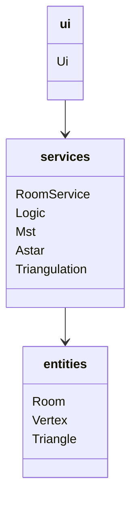

# Toteutusdokumentti

## Yleisrakenne

Ohjelma on luolaston generointi työkalu. Ohjelmaa käytetään graafisella käyttöliittymällä (pygame), josta käyttäjä voi valita huoneiden määrän ja generoida luolaston. Käyttäjä voi myös tutkia eri luolaston generointiin käytettyjen algoritmien vaiheita graafisina esityksinä. Generointi alkaa huoneiden sijaintien ja kokojen arpomisesta. Sitten ohjelma suorittaa Bowyer-Watsonin algoritmin huoneiden keskipisteiden kolmiointiin. Tämän jälkeen Primin algoritmi etsii kolmioinnista pienimmän virittävän puun. Sitten osa alkuperäisen kolmioinnin kaarista lisätään äsken saatuujen kaarien joukkoon, ja saadaan lista huoneita, joiden välillä on käytävä. Lopuksi vielä käytetään A* algoritmia käytävien lopullisten reittien määrittämiseen. A* on toteutettu niin, että olemassa olevien käytävien kautta kulkeminen on halvempaa, kuin uuden käytävän muodostaminen. 

### Rakenne kaaviona

### Luokkakaavio

## Aikavaativuudet
- Bowyer-Watson algoritmi on toteutettu O(N log N) ajassa
- Prim algoritmi toteutettu O(N^2) ajassa
- A* algoritmi toteutettu O(b^d) ajassa

## Puutteet ja parannusehdotukset
Ohjelman suurin kompastuskivi on luolastojen generoinnin hitaus. Tällä hetkellä generointiin menee noin 5-10 sekunttia. Hitaus johtuu Astar luokan make_edge_list metodista, jossa generoidaan 1200x900 solmulle kaarilista.
Ohjelmaa voisi myös parantaa antamalla käyttäjälle mahdollisuuden syöttää haluamansa huoneiden määrän valmiiksi annettujen vaihtoehtojen sijaan. Lisäksi mahdollisuus ladata generointu luolasto omalle laitteelle tekisi ohjelmasta hyödyllisemmän. 

## Laajat kielimallit
Ohjelmassa on hyödynnetty ChatGPT:tä seuraavissa tapauksissa:
- Apuna Triangle-luokan kolmion ulkoympyrän keskipisteen laskevissa metodeissa get_cirmum_center ja do_vertex_calculations
- Ui-luokan koodin refaktoroinnissa, sekä huoneiden määrää muuttavien nappien koordinaattien laskennassa
- RoomService-luokan check_point_inside_triangle metodin toteutuksen apuna
- Mst-luokan create_graph metodin debuggaamisessa

## Viitteet
- https://vazgriz.com/119/procedurally-generated-dungeons/ 
- https://www.cs.helsinki.fi/u/ahslaaks/tirakirja/ sivu 124
- https://www.gorillasun.de/blog/bowyer-watson-algorithm-for-delaunay-triangulation/
- https://www.freecodecamp.org/news/prims-algorithm-explained-with-pseudocode/
