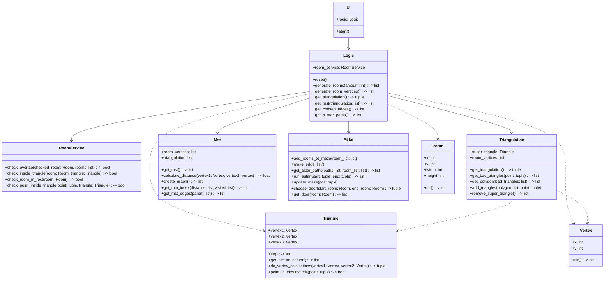

# Toteutusdokumentti

## Luokkakaavio

```mermaid
classDiagram

Ui --> Logic

Logic --> RoomService
Logic --> Triangulation
Logic --> Mst
Logic --> Astar
Logic ..> Triangle
Logic ..> Vertex
Logic ..> Room

Triangulation ..> Triangle
Triangulation ..> Vertex

class Ui {
    +logic: Logic
    +start()
}

class Logic{
    +room_service: RoomService
    +reset()
    +generate_rooms(amount: int) -> list
    +generate_room_vertices() -> list
    +get_triangulation() -> tuple
    +get_mst(triangulation: list) -> list
    +get_chosen_edges() -> list
    +get_a_star_paths() -> list
}

class RoomService {
    +check_overlap(checked_room: Room, rooms: list) -> bool
    +check_inside_triangle(room: Room, triangle: Triangle) -> bool
    +check_room_in_rect(room: Room) -> bool
    +check_point_inside_triangle(point: tuple, triangle: Triangle) -> bool
}

class Triangulation {
    +super_triangle: Triangle
    +room_vertices: list
    +get_triangulation() -> tuple
    +get_bad_triangles(point: tuple) -> list
    +get_polygon(bad_triangles: list) -> list
    +add_triangles(polygon: list, point: tuple)
    +remove_super_triangle() -> list
}

class Mst {
    +room_vertices: list
    +triangulation: list
    +get_mst() -> list
    +calculate_distance(vertex1: Vertex, vertex2: Vertex) -> float
    +create_graph() -> list
    +get_min_index(distance: list, visited: list) -> int
    +get_mst_edges(parent: list) -> list
}

class Astar {
    +add_rooms_to_maze(room_list: list)
    +make_edge_list()
    +get_astar_paths(paths: list, room_list: list) -> list
    +run_astar(start: tuple, end: tuple)-> list
    +update_maze(pos: tuple)
    +choose_door(start_room: Room, end_room: Room) -> tuple
    +get_door(room: Room) -> list
}

class Room {
    +x: int
    +y: int
    +width: int
    +height: int
    +str() -> str
}

class Vertex {
    +x: int
    +y: int
    +str() -> str
}

class Triangle {
    +vertex1: Vertex
    +vertex2: Vertex
    +vertex3: Vertex
    +str() -> str
    +get_circum_center() -> list
    +do_vertex_calculations(vertex1: Vertex, vertex2: Vertex) -> tuple
    +point_in_circumcircle(point: tuple) -> bool
}

```
